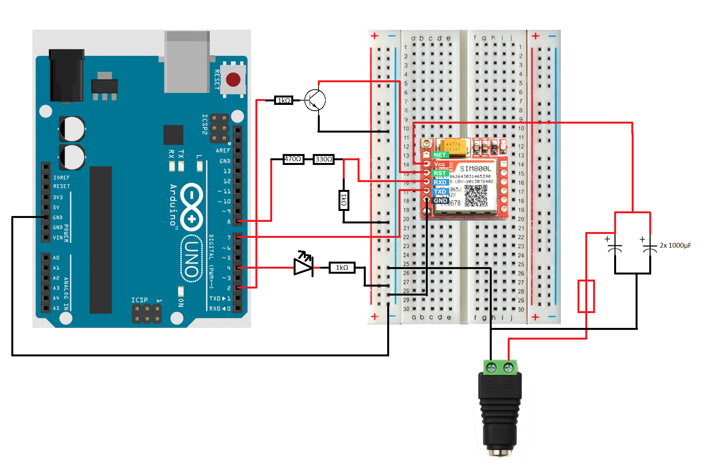

# Zdalne Sterowanie z wykorzystaniem SIM800L 🚀

## Opis 📋
Projekt umożliwia zdalne sterowanie urządzeniem za pomocą sieci GSM. Po odebraniu połączenia moduł SIM800L nasłuchuje tonów DTMF. Wprowadź 4-cyfrowy kod, a jeśli jest poprawny – dioda LED zaświeci się na 5 sekund! 💡

## Wymagane komponenty oraz ich rola🔧
- Arduino Uno (mikrokontroler do obsługi kodu)
- moduł GSM SIM800L (moduł do komunikacji w sieci GSM)
- dioda LED czerwona (1,6V-2,4V) (sygnalizuje poprawne działanie układu)
- 2 x kondensator 1000μF (stabilizuje prąd w układzie, pobór prądu przez moduł SIM800L może skoczyć do 2A)
- tranzystor 2N3904
- bezpiecznik
- rezystory (3x 1kΩ, 1x 330Ω, 1x 470Ω)
- przewody połączeniowe
- zasilacz DC 5V/3A
- gniazdo DC
- karta SIM z usługami głosowymi

## Schemat elektryczny 🗺️

## Konfiguracja ⚙️
1. Otwórz projekt w Arduino IDE.
2. Upewnij się, że masz zainstalowaną bibliotekę SoftwareSerial.
3. W pliku `main.ino` dostosuj kod PIN karty SIM w komendzie `AT+CPIN`.
4. W razie potrzeby zmień wartość `correctCode`.

## Sposób działania 🎯
1. Moduł loguje się do sieci GSM.
2. Odbiera połączenie (`RING`) i odpowiada `ATA`.
3. Nasłuchuje tonów DTMF.
4. Po wpisaniu 4-cyfrowego kodu:
   - ✅ Poprawny: `ATH`, LED świeci 5 s 💡
   - ❌ Niepoprawny: `ATH` i reset.
5. System wraca do nasłuchiwania kolejnych połączeń. 🔄
